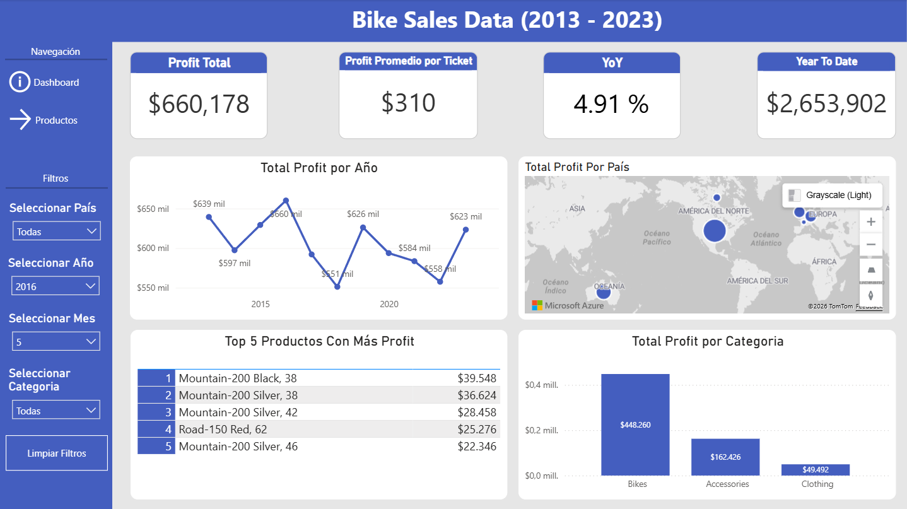
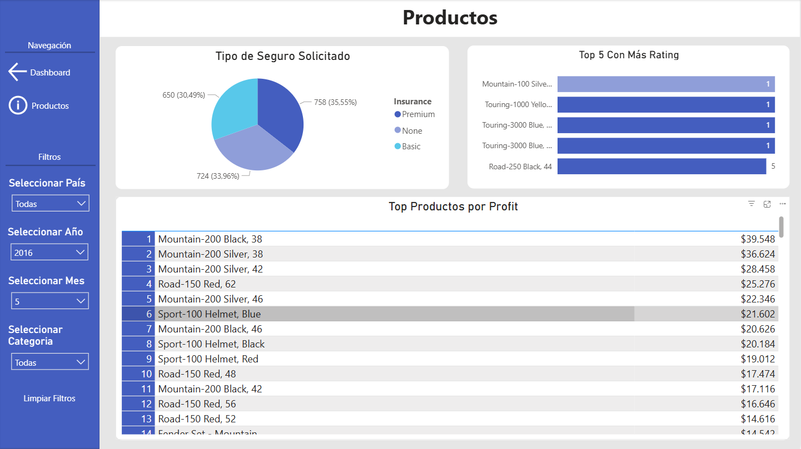

# Bike Sales Dashboard

## Objetivo
Analizar el desempeño de ventas de bicicletas y accesorios entre 2013 y 2023, identificando productos más rentables, mercados clave y variaciones anuales.

## Dataset
Vía Kaggle: https://www.kaggle.com/datasets/hamedahmadinia/global-bike-sales-dataset-2013-2023

## Visualizaciones incluidas
- Línea temporal de profit por año.  
- Mapa geográfico de profit por país.  
- Tabla de Top 5 productos más rentables.  
- Gráfico de barras por categoría (Bikes, Accessories, Clothing).  
- Filtros interactivos: país, año, mes, categoría.  

## Proceso
- Limpieza y transformación de datos para asegurar consistencia en categorías y fechas.  
- Creación de medidas DAX para YoY y YTD.  
- Integración de filtros dinámicos en Power BI.  

## Insights clave
- Las bicicletas generan más del 60% del profit total.  
- El mercado más rentable se concentra en América del Norte y Europa.
- El profit anual muestra fluctuaciones significativas entre $551 mil y $660 mil.
- A pesar de las caídas, el negocio logra recuperarse en años posteriores

## Capturas

