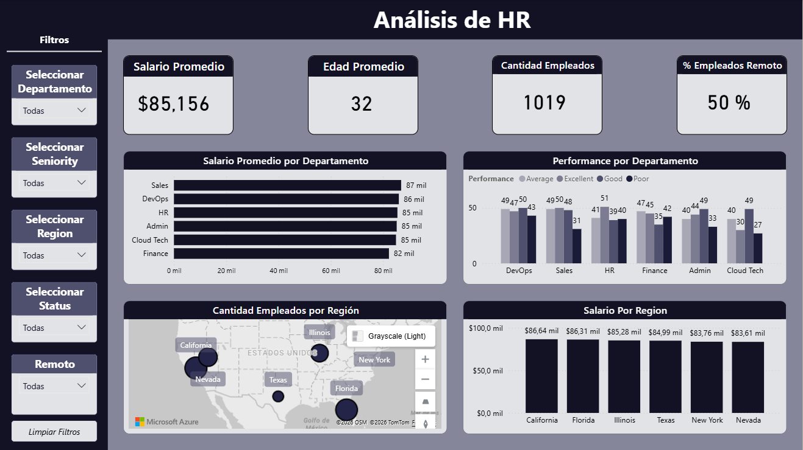

# HR Analysis Dashboard

## Objetivo
Analizar métricas clave de Recursos Humanos para entender la composición de la fuerza laboral, las brechas salariales y el desempeño por departamento y región.

## KPIs principales
- **Salario Promedio:** $85,156  
- **Edad Promedio:** 32 años  
- **Cantidad de Empleados:** 1,019  
- **% Empleados Remoto:** 50%  

## Visualizaciones incluidas
- **Salario promedio por departamento** (Sales, DevOps, HR, Admin, Cloud Tech, Finance).  
- **Performance por departamento** (Excellent, Good, Average, Poor).  
- **Cantidad de empleados por región** (mapa interactivo de EE.UU.).  
- **Salario promedio por región** (California, Florida, Illinois, Texas, New York, Nevada).  

## Proceso técnico
- **Limpieza de datos:** El dataset original estaba desordenado, con categorías duplicadas y valores inconsistentes. Se aplicaron pasos de normalización, tratamiento de nulos y estandarización de nombres de departamentos y regiones.  
- **Transformación:** Creación de columnas calculadas y medidas para KPIs (salario promedio, % remoto).  
- **Visualización:** Diseño de un dashboard ejecutivo con filtros dinámicos (Departamento, Seniority, Región, Status, Modalidad).  

## Insights clave
- Los salarios más altos se concentran en **Sales** y **DevOps**, mientras que **Finance** presenta el promedio más bajo.  
- El **50% de los empleados trabajan en modalidad remota**, lo que refleja un equilibrio entre presencial y remoto.  
- **California y Florida** lideran en salario promedio, superando los $86 mil, mientras que **Nevada y New York** muestran valores más bajos.  
- La edad promedio de 32 años indica una fuerza laboral relativamente joven, lo que puede influir en políticas de capacitación y retención.  

## Capturas

