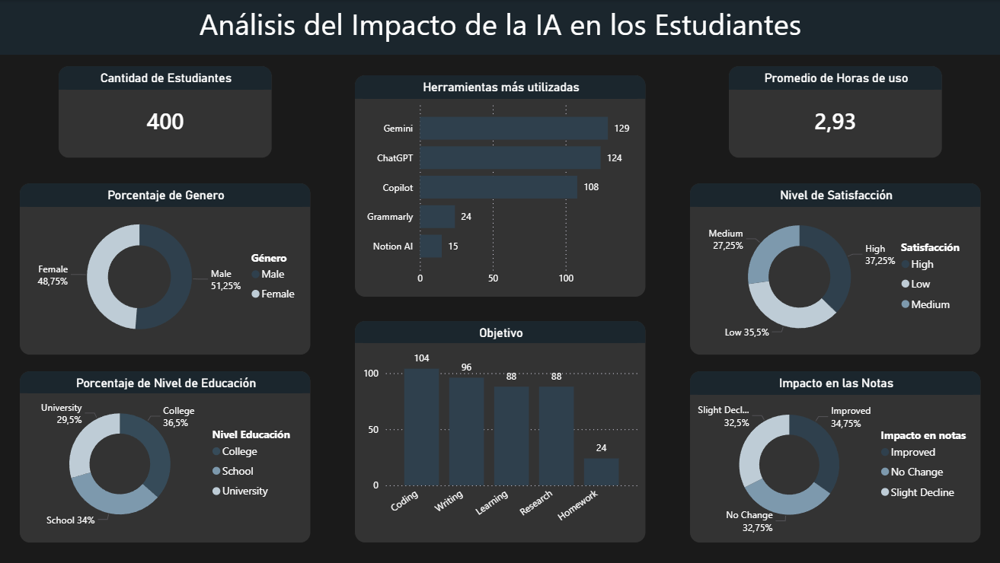

# Impacto de la IA en Estudiantes

## Objetivo
Analizar cómo los estudiantes utilizan herramientas de inteligencia artificial, cuáles son sus objetivos principales y qué impacto perciben en su rendimiento académico.

## KPIs principales
- **Cantidad de Estudiantes:** 400  
- **Promedio de Horas de Uso:** 2.93 horas  
- **Distribución de Género:** Male 51.25% / Female 48.75%  
- **Distribución por Nivel Educativo:** College 36.5%, School 34%, University 29.5%  

## Visualizaciones incluidas
- **Herramientas más utilizadas:** Gemini, ChatGPT, Copilot, Grammarly, Notion AI.  
- **Objetivos de uso:** Coding, Writing, Learning, Research, Homework.  
- **Nivel de satisfacción:** High, Medium, Low.  
- **Impacto en las notas:** Improved, No Change, Slight Decline.  

## Proceso técnico
- **Modelado de datos:** Se cargó el dataset de encuestas en Power BI y se organizaron las tablas para análisis.  
- **Medidas DAX:** Creación de KPIs como promedio de horas de uso y distribuciones porcentuales por género y nivel educativo.  
- **Visualización:** Diseño de un dashboard interactivo con gráficos de barras, donuts y tarjetas de KPIs para mostrar insights de manera clara.  

## Insights clave
- **Herramientas líderes:** Gemini y ChatGPT son las más utilizadas, seguidas por Copilot. Grammarly y Notion AI tienen menor adopción.  
- **Objetivos principales:** Coding y Writing concentran la mayor parte del uso, lo que refleja que los estudiantes aplican IA en tareas prácticas y creativas.  
- **Satisfacción dividida:** Aunque un 37% reporta alta satisfacción, más de un tercio indica baja satisfacción, lo que sugiere espacio para mejorar la experiencia de uso.  
- **Impacto académico:** El 34.75% de los estudiantes percibe mejoras en sus notas, pero un 32.5% reporta una leve caída, lo que indica que el uso de IA no garantiza automáticamente mejores resultados.  
- **Perfil del estudiante:** La edad y nivel educativo muestran una distribución equilibrada, con predominio de estudiantes de College y School.  

## Captura

